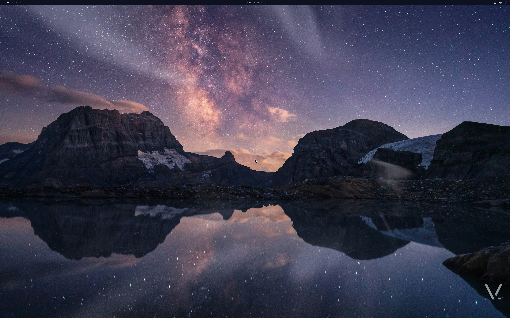

<p align="center">
  
</p>

<h1 align="center">vinOS</h1>

<p align="center">
  <strong>The agentic startup OS.</strong>
</p>

<p align="center">
  <em>Secure by default · sandboxed · local-first · sovereign</em>
</p>

<p align="center">
  <a href="https://github.com/sponsors/vinpatel"></a>
  <a href="https://opencollective.com/vinos"></a>
  <a href="LICENSE"></a>
  <a href="https://github.com/vinpatel/vinos/releases"></a>
  <a href="https://archive.org/details/vinos-2.0.5-x86_64"></a>
</p>

<p align="center">
  Linux with agents built in. On a schedule. On your machine.<br>
  Autonomous agents fire on systemd timers — your morning brief at 6&nbsp;am,<br>
  PR review every 30 minutes, evening shutdown at 6&nbsp;pm.<br>
  80% runs on a local model. Free. Offline. On your metal.
</p>

<p align="center">
  <a href="https://vinos.computer">vinos.computer</a> &nbsp;·&nbsp;
  <a href="https://archive.org/details/vinos-2.0.5-x86_64">Download</a> &nbsp;·&nbsp;
  <a href="https://vinos.computer/docs/">Docs</a> &nbsp;·&nbsp;
  <a href="https://vinos.computer/routines/">Routines</a> &nbsp;·&nbsp;
  <a href="https://vinos.computer/for/enterprise/">For enterprise</a> &nbsp;·&nbsp;
  <a href="docs/v2/vinos-routine-spec.md">Spec</a>
</p>

<p align="center">
  <a href="https://vinos.computer">
    
  </a>
</p>

<p align="center">
  <em>If this saves you a subscription — or a setup weekend — a ⭐ helps others find it.</em>
</p>

---

## Why vinOS

The other OSes have you *talk to* AI. **vinOS runs agents that work while you sleep.**

- 🌅 **A brief on your login screen every morning.** Reads your inbox, calendar, GitHub. Costs a penny.
- 🔍 **PR reviews while you're in a meeting.** Every 30 minutes. Local model first — Claude only for the tricky diffs.
- 📄 **Agents that travel with your code.** Drop `.vinos/routines.yaml` in any repo. Your team inherits the same set.

## What ships

- 🤖 **`vinos-routine`** — the runtime. TOML-defined agents on systemd timers, whitelist-enforced tools inside `bwrap` sandbox, SQLite ledger tracking tokens + cost + escalations. See [routine spec](docs/v2/vinos-routine-spec.md).
- 💰 **80/20 auto-router** — `route = "auto"` runs a local Ollama model first; escalates to Claude only on low-confidence / reasoning / context-overflow. Saves ~$360/mo vs. all-premium on a typical 500-routine day.
- 📦 **Portable `.vinos/routines.yaml`** — commit agents next to your code. Same file runs on your laptop today and on your Kubernetes cluster (v2.1). See [yaml spec](docs/v2/vinos-routines-yaml-spec.md).
- ✨ **Signature `vinos-*` utilities** — `vinos-standup` (git → standup), `vinos-commit` (AI commit messages), `vinos-focus` (DND with timer), `vinos-fix` (pipe stderr → diagnosis), `vinos-explain` (pipe anything → plain English), `vinos-brief` (today's routine outputs).
- 🎨 **10 curated themes** with real HD wallpapers by working photographers (David Clode, Pascal Debrunner, Marek Piwnicki, and more via Unsplash). `omarchy-theme-menu` switches live.
- 🖥️ **T2 MacBook Pro first-class** — `linux-t2` kernel, brcmfmac wifi recipe, keyboard + trackpad + audio + Touch Bar out of box.
- 🔒 **Secure by default** — bwrap sandbox for shell tools, whitelist-only tool grants, per-run + per-day budget caps enforced by runtime (not by the model), local-first (routines never touch a network unless declared).

## Install

**Flash the ISO** — no prior Arch needed:

```bash
# 1. Download from archive.org (5.3 GB)
curl -L -o vinos-2.0.5-x86_64.iso \
  https://archive.org/download/vinos-2.0.5-x86_64/vinos-2.0.5-x86_64.iso

# 2. Flash to USB (replace /dev/sdX with your USB device — check `lsblk`)
sudo dd if=vinos-2.0.5-x86_64.iso of=/dev/sdX bs=4M status=progress oflag=direct conv=fsync && sync

# 3. Boot the target machine off the USB, then:
sudo vinos-install-disk
```

Full walkthrough with screenshots: [vinos.computer/docs/getting-started/](https://vinos.computer/docs/getting-started/).

## Try a routine

Set an Anthropic API key (or install Ollama locally with `vinos-install-ai`):

```bash
export ANTHROPIC_API_KEY=sk-ant-...          # or write to ~/.vinos/secrets/anthropic-key
vinos-routine list                            # see shipped starters
vinos-routine run day-brief                   # ad-hoc invocation
vinos-brief day-brief                         # read the markdown output
vinos-routine cost                            # ledger: tokens + $ + escalations
vinos-routine enable day-brief                # activate the 6am systemd timer
```

Or drop a `.vinos/routines.yaml` next to your code and share the agent set with your team:

```bash
vinos-routine load .                          # walks up to your repo root
```

## Keybindings (a taste)

| Chord | Action |
|---|---|
| `Super + Return` | Terminal (foot) |
| `Super + Space` | Walker launcher |
| `Super + Ctrl + O` | vinOS menu (hub) |
| `Super + Ctrl + T` | Theme switcher |
| `Super + K` | Cheat sheet (live from your Hyprland config) |
| `Super + Shift + A` | Claude Code in current project |

Full list: [vinos.computer/docs/customization/keybindings/](https://vinos.computer/docs/customization/keybindings/) — auto-generated from `configs/omarchy/default/hypr/bindings/`.

## For who

- 👤 **[Founders](https://vinos.computer/for/founders/)** — get your Sunday back
- 🧑‍💻 **[Engineers](https://vinos.computer/for/engineers/)** — agents that live next to your code
- 🏢 **[Enterprise IT](https://vinos.computer/for/enterprise/)** — the agentic OS with guardrails built in
- ☁️ **[Platform teams](https://vinos.computer/for/platform/)** — runs on your laptop, ships to your cluster
- 🔬 **[Researchers](https://vinos.computer/for/researchers/)** — local models, your papers stay yours

## Roadmap

- [x] **v2.0.5** — shipping. 10 themes, foot.ini fix, Docker + dua-cli, `.vinos/routines.yaml` loader, 5 signature vinos-* utilities.
- [x] **v2.0.6** — auto-router (`route = "auto"` + escalation policy), routine memory (session/persistent/shared), cron→OnCalendar translator, 15 `vinos-*` wrappers rebranding user-facing `omarchy-*` commands.
- [ ] **v2.0.7** — routine gallery on vinos.computer, `vinos-routine install <slug>`, waybar routine widget.
- [ ] **v2.1** — **[vinOS Cloud](docs/v2/vinos-cloud-spec.md)** — Docker image + Helm chart + systemd-nspawn. Same `.vinos/routines.yaml` runs on the laptop AND on your Kubernetes cluster. Agents don't stop when your laptop closes.
- [ ] **v2.2** — team-shared routines, multi-tenant, cross-machine ledger sync.

Full [ROADMAP.md](docs/v2/ROADMAP.md) — includes non-goals (no QuickShell rewrite, no Omarchy fork, no CachyOS repos).

## Bundles

Base ISO is agent-focused (~5 GB with Ollama-ready runtime). Opt-in bundles for everything else:

`ai` · `dev` · `media` · `office` · `gaming` · `comms` · `browser` · `productivity`

```bash
vinos-install-ai         # ollama, claude-code, python-anthropic, jupyter …
vinos-install-dev        # postgres, redis, kubectl, helm, terraform, mise …
vinos-install-media      # mpv, kdenlive, obs-studio, pinta …
```

Full list: [docs/BUNDLES.md](docs/BUNDLES.md).

## Docs

- 🌐 **[vinos.computer](https://vinos.computer)** — the site
- 📚 **[/docs](https://vinos.computer/docs/)** — getting started, agents, utilities, themes, customization, troubleshooting, reference
- 🧬 **[Routine spec](docs/v2/vinos-routine-spec.md)** — TOML schema, runtime lifecycle, tools + sandbox, ledger, escalation heuristics
- 📄 **[.vinos/routines.yaml spec](docs/v2/vinos-routines-yaml-spec.md)** — portable project spec (v1)
- ☁️ **[Cloud spec](docs/v2/vinos-cloud-spec.md)** — v2.1 headless runtime (Docker + Helm + cloud-init)
- 🗺️ **[Roadmap](docs/v2/ROADMAP.md)** — what's shipped, what's in flight, what we're explicitly not doing

## Contributing

Issues and PRs welcome. This is a project that runs on people finding it useful and telling other people. If you install vinOS and it works — [star the repo](https://github.com/vinpatel/vinos), [tell someone](https://twitter.com/intent/tweet?text=vinOS%20%E2%80%94%20the%20agentic%20startup%20OS.%20Agents%20on%20a%20schedule.%20Local%2Bpremium%20router.%20https%3A%2F%2Fvinos.computer), or [open a discussion](https://github.com/vinpatel/vinos/discussions).

If you install vinOS and it doesn't work — [open an issue](https://github.com/vinpatel/vinos/issues/new/choose) with the output of `vinos-doctor` and your hardware.

## 💛 Sponsor this project

vinOS is MIT-licensed, built in the open by [Vin Patel](https://github.com/vinpatel), and free forever. If it saves you time or money, sponsorship keeps it going:

- 💛 **[GitHub Sponsors](https://github.com/sponsors/vinpatel)** — recurring, project-level
- 🎁 **[Open Collective](https://opencollective.com/vinos)** — one-off, transparent ledger
- ⭐ **A star on this repo** — free, and the strongest single signal to new visitors

Corporate sponsorship (Cloudflare OSS, Anthropic OSS, and others) will fund the v2.1 Cloud runtime + a hosted routines gallery. Get in touch via [Discussions](https://github.com/vinpatel/vinos/discussions) if you want to sponsor at that tier.

## License

MIT — see [LICENSE](LICENSE). Third-party components (Omarchy MIT, linux-t2 GPL-2.0, Broadcom firmware, NASA + Unsplash imagery) attributed in [NOTICES.md](NOTICES.md).
