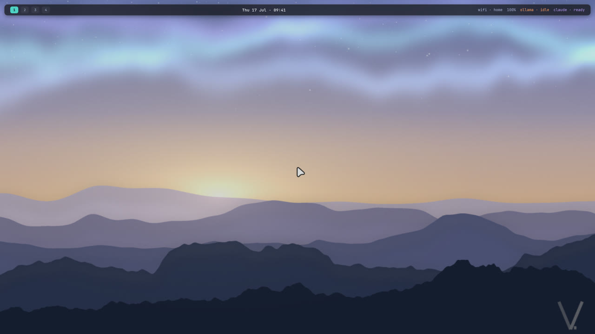
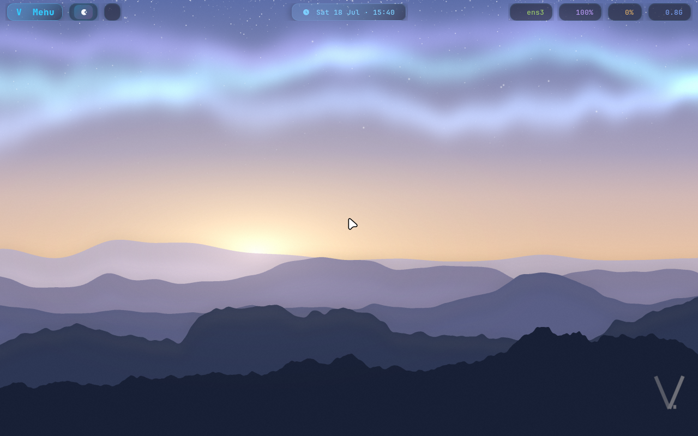
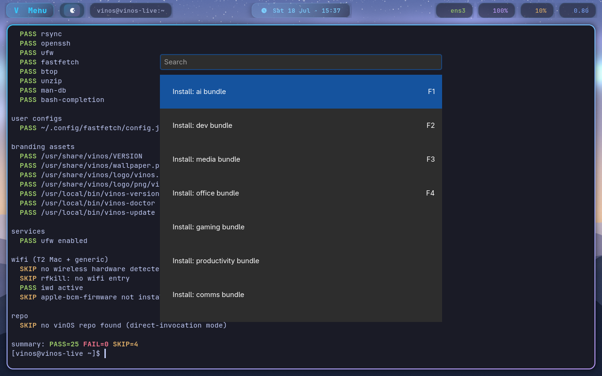
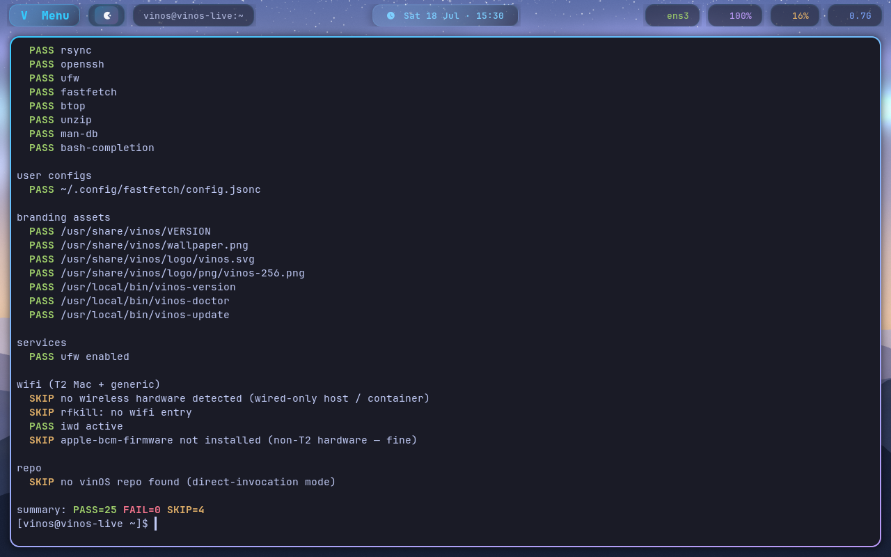
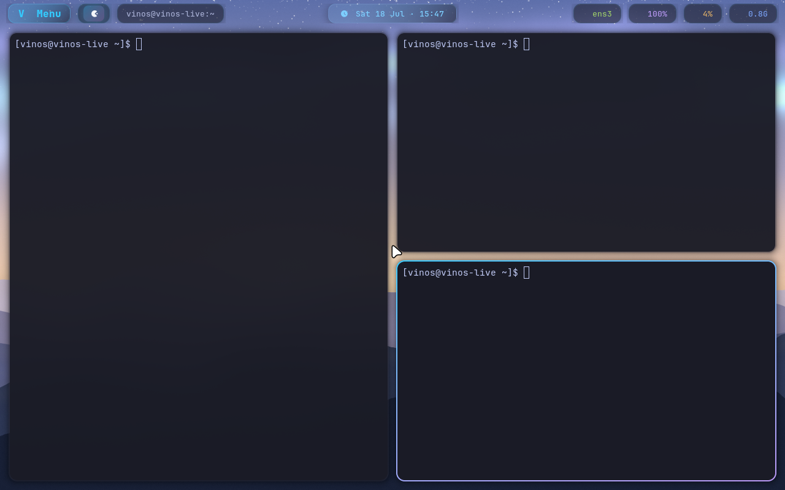

<p align="center">
  
</p>

<h1 align="center">vinOS</h1>

<p align="center">
  <strong>An agentic OS for founders, innovators, and thinkers.</strong>
</p>

<p align="center">
  <a href="https://github.com/sponsors/vinpatel"></a>
  <a href="https://opencollective.com/vinos"></a>
  <a href="LICENSE"></a>
  <a href="https://github.com/vinpatel/vinos/releases"></a>
  <a href="https://archive.org/details/vinos-1.1.0-x86_64"></a>
</p>

<p align="center">
  Flash a USB. Boot. In fifteen minutes, local LLMs and Claude Code<br>
  are one keystroke away — on any x86_64 laptop, workstation, or server.
</p>

<p align="center">
  <a href="https://vinos.computer">vinos.computer</a> &nbsp;·&nbsp;
  <a href="https://archive.org/details/vinos-1.1.0-x86_64">Download</a> &nbsp;·&nbsp;
  <a href="docs/INSTALL.md">Install guide</a> &nbsp;·&nbsp;
  <a href="docs/BUNDLES.md">Bundles</a> &nbsp;·&nbsp;
  <a href="docs/HARDWARE.md">Hardware matrix</a> &nbsp;·&nbsp;
  <a href="https://github.com/vinpatel/vinos/discussions">Discussions</a>
</p>

<p align="center">
  <a href="https://vinos.computer">
    
  </a>
</p>

---

## What it does

- 🤖 **Agent-native from first boot.** `Super+A` → local LLM (Ollama). `Super+Shift+A` → Claude Code. `vinos-ai chat` in any terminal.
- 💻 **Runs on any x86_64.** Framework, System76, StarLabs, Tuxedo, your old MacBook, the box in your basement. `linux-t2` baked into the ISO so Intel MacBooks work on first boot — keyboard, trackpad, Wi-Fi, Touch Bar.
- 🎨 **Beautiful Wayland desktop.** Hyprland + waybar + walker + foot + hyprlock. Tokyo-night polish. Sensible defaults. No setup weekend.
- 📦 **8 opt-in bundles.** `ai · dev · media · office · gaming · comms · browser · productivity` — one command each. `vinos-install ai` and you're done.
- 🔧 **88 `vinos-*` helpers.** Every one a shell script you can read. `vinos-doctor` for status. `vinos-menu` (`Super+Ctrl+O`) for the hub.
- 🔒 **Local-first economics.** 80% of agent workloads on your own GPU. Frontier API for the 20% that needs it. Your prompts, files, and keys don't leave your hardware.

## Screenshots

Real frames from a boot of the shipping ISO. See [the site](https://vinos.computer) for the full walkthrough video.

<table>
  <tr>
    <td width="50%"></td>
    <td width="50%"></td>
  </tr>
  <tr>
    <td align="center"><em>Hyprland desktop, first boot — no dotfile weekend</em></td>
    <td align="center"><em><code>Super+Ctrl+O</code> — the vinOS hub (bundles, themes, doctor, wifi)</em></td>
  </tr>
  <tr>
    <td width="50%"></td>
    <td width="50%"></td>
  </tr>
  <tr>
    <td align="center"><em><code>vinos-doctor</code> — every check green on a fresh boot</em></td>
    <td align="center"><em>Hyprland tiling. One workspace, three panes.</em></td>
  </tr>
</table>

## 💛 Sponsor this project

vinOS is solo-maintained and MIT licensed. If it saves you a subscription fee or a weekend of setup, please consider supporting the work:

<p align="center">
  <a href="https://github.com/sponsors/vinpatel"></a>
  &nbsp;
  <a href="https://opencollective.com/vinos"></a>
</p>

Sponsors fund:

- **Real-hardware verification** — Framework, StarLabs, Tuxedo, older ThinkPads, MacBooks
- **Infrastructure** — archive.org hosting, GitHub Actions runners, build machines
- **Roadmap work** — fleet management, agent snapshots, audit/safety layers, offline docs
- **Community support** — hardware reports, documentation, response time

**For OEMs and enterprise deployments:** [`hello@vinos.computer`](mailto:hello@vinos.computer).

## Install

**Path A — flash the ISO** (recommended, no prior Arch needed):

```bash
# 1. Download from archive.org (4.3 GB)
curl -L -o vinos-1.1.0-x86_64.iso \
  https://archive.org/download/vinos-1.1.0-x86_64/vinos-1.1.0-x86_64.iso

# 2. Flash to USB (replace /dev/sdX with your USB device — check `lsblk`)
sudo dd if=vinos-1.1.0-x86_64.iso of=/dev/sdX bs=4M status=progress oflag=direct conv=fsync

# 3. Boot the target machine off the USB, then:
sudo vinos-install-disk
```

**Path B — layer onto existing Arch:**

```bash
curl -fsSL https://raw.githubusercontent.com/vinpatel/vinos/main/boot.sh | bash
```

Clones this repo to `~/.local/share/vinos` and runs `install.sh` idempotently. Full details: [`docs/INSTALL.md`](docs/INSTALL.md).

## Keybindings (a taste)

| Chord | Action |
|---|---|
| `Super + A` | Local AI chat (Ollama) |
| `Super + Shift + A` | Claude Code in project |
| `Super + Space` | Walker launcher |
| `Super + Return` | Terminal (foot) |
| `Super + Ctrl + O` | vinOS menu (hub) |
| `Super + Ctrl + W` | Wi-Fi picker (impala) |
| `Super + Ctrl + T` | Live theme switch |
| `Super + K` | Full cheat sheet (live from your Hyprland config) |

Full list: [`docs/KEYBINDINGS.txt`](docs/KEYBINDINGS.txt).

## Roadmap

- [x] **v1.1.0** — shipping. Boots clean on x86_64 + Intel T2 Macs. 8 opt-in bundles. Local + frontier AI wired.
- [ ] **v1.2** — AI stack preloaded in the base ISO (Super+A works out of box). Cockpit + nodes for fleet deployments. Agent snapshots + audit. OEM preload builds.
- [ ] **v1.3** — Custom-branded builds for enterprise. Community model marketplace. First-party hardware partner announcement.

## Bundles

Add only what you use — each bundle is a plain list of packages, no magic.

| Bundle | Command | What's inside |
|---|---|---|
| `ai` | `vinos-install ai` | ollama · claude-code · open-webui · llm |
| `dev` | `vinos-install dev` | neovim · lazygit · docker · gh · nodejs · rustup · uv · direnv |
| `media` | `vinos-install media` | mpv · imv · yt-dlp · ffmpeg · spotify · pinta |
| `office` | `vinos-install office` | libreoffice · zathura · obsidian · localsend |
| `gaming` | `vinos-install gaming` | steam · lutris · gamemode · mangohud · protontricks |
| `comms` | `vinos-install comms` | signal-desktop · slack · zoom · discord |
| `browser` | `vinos-install browser` | chromium · firefox · brave-bin |
| `productivity` | `vinos-install productivity` | obsidian · dbeaver · postman · flameshot · syncthing |

Read the bundle definitions: [`docs/BUNDLES.md`](docs/BUNDLES.md).

## Docs

**Start with [`docs/README.md`](docs/README.md)** — the documentation index. It routes you to the right doc based on what you're trying to do.

### For users
- [`docs/QUICKSTART.md`](docs/QUICKSTART.md) — first-boot walkthrough
- [`docs/INSTALL.md`](docs/INSTALL.md) — install paths (fresh USB, existing Arch, T2 Mac)
- [`docs/USB.md`](docs/USB.md) — flashing live USBs
- [`docs/HARDWARE.md`](docs/HARDWARE.md) — verified-hardware matrix
- [`docs/KEYBINDINGS.txt`](docs/KEYBINDINGS.txt) — the cheat sheet `Super+K` shows
- [`docs/BUNDLES.md`](docs/BUNDLES.md) — every opt-in bundle
- [`docs/PREFLIGHT.md`](docs/PREFLIGHT.md) — the mandatory pre-flash gate

### For reviewers (understanding how vinOS is built)
- [`docs/VISION.md`](docs/VISION.md) — why vinOS exists, the two-product framing, the north star
- [`docs/ARCHITECTURE-v1.1.0.md`](docs/ARCHITECTURE-v1.1.0.md) — the frozen baseline architecture reference
- [`docs/DECISIONS.md`](docs/DECISIONS.md) — every big design decision (why Ubuntu for the VM, why no Omarchy, why runner-agnostic, etc.)
- [`.planning/RULES.md`](.planning/RULES.md) — durable rules that govern all future work
- [`.planning/ROADMAP.md`](.planning/ROADMAP.md) — milestones v1.2.0 → v1.4.0
- [`.planning/research/PERSONAS.md`](.planning/research/PERSONAS.md) — full dual-persona design spec

### For contributors
- [`docs/CONTRIBUTING.md`](docs/CONTRIBUTING.md) — dev setup, commit style, review flow
- [`docs/BUILDING.md`](docs/BUILDING.md) — reproduce the ISO from source, step-by-step
- [`iso/README.md`](iso/README.md) — the ISO build subsystem
- [`ATTRIBUTIONS.md`](ATTRIBUTIONS.md) — prior-art credits

## Contributing

Every script is Bash, shellcheck-clean, under ~80 lines. Config lives in `config/` and gets rsync'd to `~/.config/`.

Read [`docs/CONTRIBUTING.md`](docs/CONTRIBUTING.md) before your first PR — vinOS has strong opinions (no Omarchy code, no commit trailers, ship-gate mandatory) that are easier to honor if you know them upfront.

**Best first contribution:** [flash the ISO on a new hardware family and file a hardware report](https://github.com/vinpatel/vinos/issues/new?template=hardware-report.yml). Every report widens the compatibility matrix.

## License

MIT © Vin Patel. See [`LICENSE`](LICENSE) and [`ATTRIBUTIONS.md`](ATTRIBUTIONS.md).
